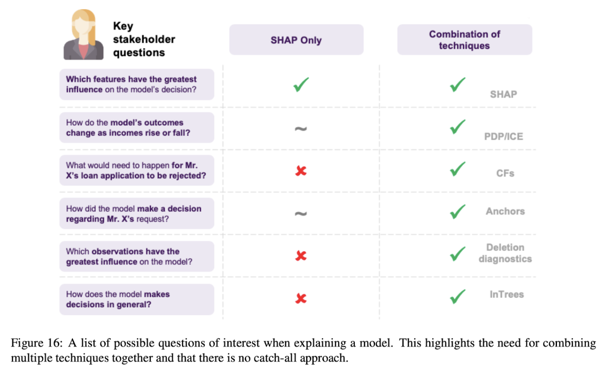

# Wrapper Methods
## Shap

# Wrapper Methods
## Partial Dependence Plots
"Let me show you what the model predicts on average when each data instance has the value v for that feature. I ignore whether the value v makes sense for all data instances."  
If PDP is constant then thera are no interactions between selected subset and other features.  
> ***Note:*** in sklearn 'partial_dependence' realization with method="brute" values are obtained by truly averaging predictions

## M-Plots
"Let me show you what the model predicts on average for data instances that have values close to v for that feature. The effect could be due to that feature, but also due to correlated features."  

## ICE
For every dataset example, we fix variables not in subset of interest and vary another.  
Advantages:
- more intuitive to understand
- uncover heterogeneous relationships  

Disadvantages:
- some points in the lines might be invalid data points
- can only display one feature *meaningfully*

## ALE plots
"Let me show you how the model predictions change in a small "window" of the feature around v for data instances in that window."  
The value of the ALE can be interpreted as the main effect of the feature at a certain value compared to the average prediction of the data.  
ALE plots show the *first or second-order* effect.

## Feature Interaction
The amount of the variance explained by the interaction (difference between observed and no-interaction PD) is used as interaction strength statistic.  
Pros:
- the statistic **detects all kinds of interactions**, regardless of their particular form  

Cons:
- computationally expensives
- results can be unstable
- the H-statistic cannot be used meaningfully if the inputs are pixels. So the technique **is not useful for image classifier**
- inherits cons of a PDP

> ***Note:*** A meaningful workflow is to measure the interaction strengths and then create 2D-partial dependence plots for the interactions you are interested in

## Scoped Rules (Anchors)
They are faithful by design and state *exactly* for which instances they are valid.  

